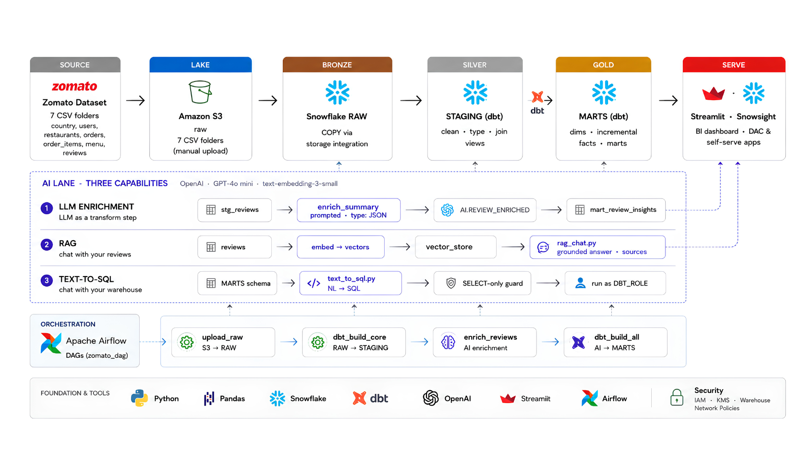
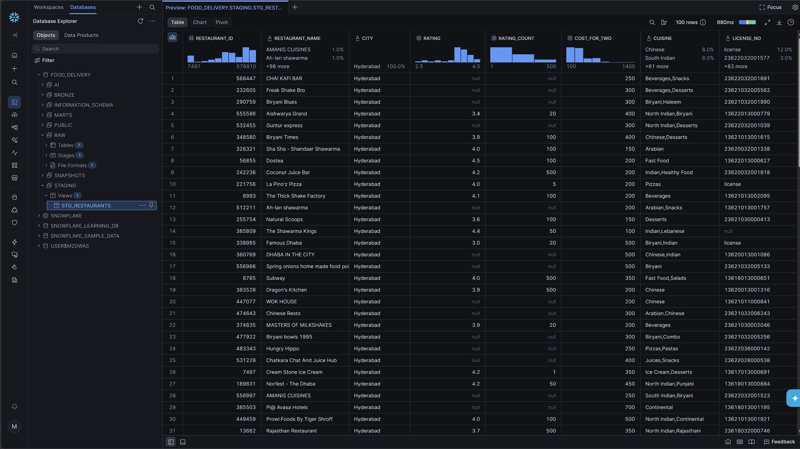

# Swiggy-Zomato AI Data Engineering Pipeline

End-to-end batch data pipeline for food-delivery analytics, combining raw CSV ingestion, Snowflake warehouse modeling, dbt transformations, Airflow orchestration, and AI-powered review workflows.

A production-style data engineering project that takes Zomato-style food delivery data from raw CSVs to AI-powered analytics:

**Food Delivery Dataset → Amazon S3 → Snowflake → dbt → Airflow → AI (OpenAI)**

The dataset lands in an S3 data lake and flows into Snowflake through a storage integration, where dbt transforms it through medallion layers: RAW (Bronze) tables loaded via `COPY INTO`, cleaned STAGING (Silver) views, and business-ready MARTS (Gold) with dimensions, incremental facts, and analytics marts. Apache Airflow orchestrates the pipeline as one daily DAG. On top of the warehouse sits an AI layer powered by OpenAI: LLM enrichment turns free-text reviews into structured, queryable columns; RAG enables chat with reviews; and text-to-SQL supports natural language queries over the warehouse. Streamlit serves the dashboards and AI apps.

## Architecture



## What this project includes

- Source datasets for restaurants, users, orders, items, menu, food, and reviews.
- AWS S3-based raw landing zone with Snowflake storage integration.
- Snowflake raw, staging, marts, and AI layers.
- dbt models for medallion transformations, incremental facts, dimensions, and curated marts.
- AI review enrichment, RAG chat, and text-to-SQL capabilities.
- Orchestration with Airflow and delivery through Streamlit and Snowsight.

## Repository Layout

- `data/` - sample CSV datasets used as inputs.
- `data/sample/` - compact Git-friendly subset of the datasets for demos and testing.
- `aws/iam/` - IAM and trust policies for AWS and Snowflake integration.
- `snowflake/` - SQL scripts for setup, storage integration, staging, raw tables, and loading.
- `docs/` - supporting documentation and architecture visuals.

## High-Level Flow

1. CSV files are uploaded to S3 as the raw landing zone.
2. Snowflake ingests the raw data into bronze tables via storage integration and `COPY INTO`.
3. dbt builds staging models, dimensions, incremental facts, and curated marts.
4. AI workflows enrich review data, power RAG search, and generate text-to-SQL responses.
5. Airflow orchestrates the pipeline, while Streamlit and Snowsight expose the results.

## dbt Staging Run

Successful staging run:

```bat
dbt run --select staging
```

The run completed with 7 successful staging views:

- `stg_restaurants`
- `stg_orders`
- `stg_order_items`
- `stg_food`
- `stg_users`
- `stg_menu`
- `stg_reviews`

## Snowflake Staging Preview



Captured after validating the dbt setup and opening the Snowflake database explorer on the `STG_RESTAURANTS` staging model. It confirms that the transformed restaurant data is loaded and queryable in the `FOOD_DELIVERY.STAGING` schema, with fields such as restaurant name, city, rating, rating count, cost for two, cuisine, and license number visible in the table view.
