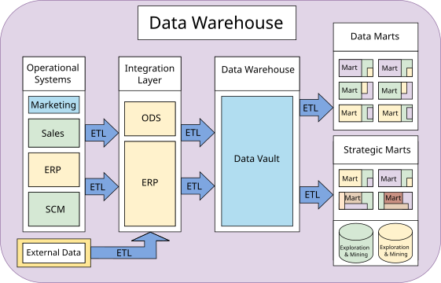
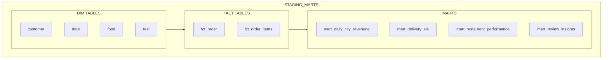
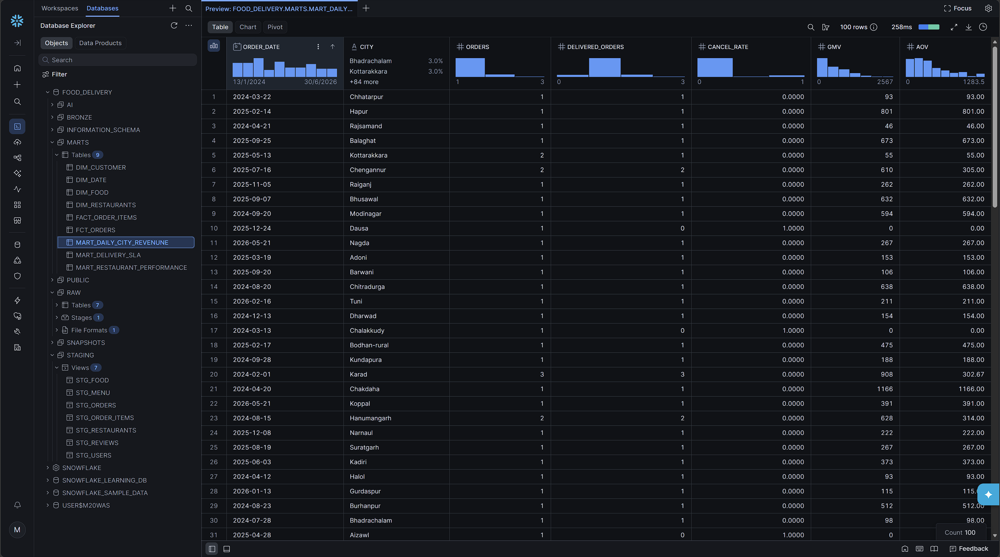

# Swiggy-Zomato AI Data Engineering Pipeline

End-to-end batch data pipeline for food-delivery analytics, combining raw CSV ingestion, Snowflake warehouse modeling, dbt transformations, Airflow orchestration, and AI-powered review workflows.

A production-style data engineering project that takes Zomato-style food delivery data from raw CSVs to AI-powered analytics:

**Food Delivery Dataset → Amazon S3 → Snowflake → dbt → Airflow → AI (OpenAI)**

The dataset lands in an S3 data lake and flows into Snowflake through a storage integration, where dbt transforms it through medallion layers: RAW (Bronze) tables loaded via `COPY INTO`, cleaned STAGING (Silver) views, and business-ready MARTS (Gold) with dimensions, incremental facts, and analytics marts. Apache Airflow orchestrates the pipeline as one daily DAG. On top of the warehouse sits an AI layer powered by OpenAI: LLM enrichment turns free-text reviews into structured, queryable columns; RAG enables chat with reviews; and text-to-SQL supports natural language queries over the warehouse. Streamlit serves the dashboards and AI apps.

## Architecture


## Warehouse and Marts Overview



## What this project includes

- Source datasets for restaurants, users, orders, items, menu, food, and reviews.
- AWS S3-based raw landing zone with Snowflake storage integration.
- Snowflake raw, staging, marts, and AI layers.
- dbt models for medallion transformations, incremental facts, dimensions, and curated marts.
- AI review enrichment, RAG chat, and text-to-SQL capabilities.
- Orchestration with Airflow and delivery through Streamlit and Snowsight.

## Repository Layout

- `data/` - sample CSV datasets used as inputs.
- `data/sample/` - compact Git-friendly subset of the datasets for demos and testing.
- `aws/iam/` - IAM and trust policies for AWS and Snowflake integration.
- `snowflake/` - SQL scripts for setup, storage integration, staging, raw tables, and loading.
- `food_delivery/macros/` - reusable dbt Jinja macros, including custom schema naming.
- `docs/` - supporting documentation and architecture visuals.

## dbt Macros

[generate_schema_name.sql](food_delivery/macros/generate_schema_name.sql) overrides dbt's default schema naming behavior. Models without a configured schema use the active target schema (`target.schema`); models configured with a schema use that exact schema name. This keeps staging models in `STAGING` and marts models in `MARTS`, rather than creating target-prefixed schema names.

In simple terms: the macro puts each model in the folder/schema name chosen in `dbt_project.yml`. A staging model goes to `STAGING`; a marts model goes to `MARTS`.

## High-Level Flow

1. CSV files are uploaded to S3 as the raw landing zone.
2. Snowflake ingests the raw data into bronze tables via storage integration and `COPY INTO`.
3. dbt builds staging models, dimensions, incremental facts, and curated marts.
4. AI workflows enrich review data, power RAG search, and generate text-to-SQL responses.
5. Airflow orchestrates the pipeline, while Streamlit and Snowsight expose the results.

## dbt Staging Run

Successful staging run:

```bat
dbt run --select staging
```

The run completed with 7 successful staging views:

- `stg_restaurants`
- `stg_orders`
- `stg_order_items`
- `stg_food`
- `stg_users`
- `stg_menu`
- `stg_reviews`

## Snowflake Staging Preview


Captured after validating the dbt setup and opening the Snowflake database explorer on the `STG_RESTAURANTS` staging model. It confirms that the transformed restaurant data is loaded and queryable in the `FOOD_DELIVERY.STAGING` schema, with fields such as restaurant name, city, rating, rating count, cost for two, cuisine, and license number visible in the table view.

### Why `.yml` files in `models/staging/`

- `_sources.yml` / `_ai_sources.yml` declare the raw Snowflake tables (`source('raw', ...)`) that staging models select from, so dbt can track lineage and freshness.
- `_staging.yml` documents each staging model's columns and attaches data tests (`unique`, `not_null`) on primary keys like `order_id`, `restaurant_id`, `customer_id`, `review_id` - these are `.yml`-only config, no SQL involved.

## dbt Marts Layer

The marts layer turns the cleaned staging models into reusable business tables in the `FOOD_DELIVERY.MARTS` schema.

To run all models in the marts directory/tag, use:

```powershell
dbt run --select marts
```

(or using the shorthand flag)

```powershell
dbt run -s marts
```





Dimensions:

- `dim_customer` - customer profile dimension with age segmentation.
- `dim_date` - calendar spine for date-based reporting and time intelligence.
- `dim_food` - food catalog dimension with vegetarian/non-vegetarian flag.
- `dim_restaurants` - restaurant dimension with city, cuisine, rating, and cost fields.

Facts:

- `fct_orders` - incremental order-level fact table built from staged orders, with delivery, payment, and sales metrics.
- `fact_order_items` - incremental order-item fact table joined to orders to add timestamps, city, and line-level values.

Analytics marts:

- `mart_daily_city_revenune` - daily city-level order volume, delivery, cancellation, GMV, and AOV metrics.
- `mart_delivery_sla` - delivery SLA view showing delivered orders by city and hour, plus p50 and p90 delivery times.
- `mart_restaurant_performance` - restaurant performance summary with order count, revenue, customer rating, and average delivery time.
- `mart_review_insights` - review sentiment and topic analysis by city.

These marts provide the curated outputs for reporting, restaurant analysis, delivery monitoring, and AI-driven review insighting.

### Why `.yml` files in `models/marts/`

`_marts.yml` documents mart models and defines stronger data tests than staging, since marts are business-facing: `unique`/`not_null` on `fct_orders.order_id`, `accepted_values` on `order_status`, and a `relationships` test enforcing referential integrity between `fct_orders.customer_id` and `dim_customer.customer_id`. These `.yml` files are what `dbt test` (below) actually runs against - no test logic lives in the `.sql` files themselves.

## dbt Build

Build every model and run its associated data tests in one command:

```bat
dbt build
```

The recorded build completed successfully: 7 staging views, 7 table models, 2 incremental fact models, and 16 data tests (32 successful operations total).

## dbt Test

Data tests (`unique`, `not_null`, `accepted_values`, `relationships`) validate staging and marts models:

```bat
dbt test
```

All 16 data tests passed: primary key `unique`/`not_null` checks on staging models, `not_null`/`unique` on `fct_orders`, an `accepted_values` check on `order_status`, and a `relationships` (referential integrity) check between `fct_orders.customer_id` and `dim_customer.customer_id`.

## dbt Documentation

Generate the dbt documentation catalog and serve it locally:

```bat
dbt docs generate && dbt docs serve
```

The catalog is written to `food_delivery/target/catalog.json`. Open `http://localhost:8080` while the server is running, then press `Ctrl+C` to stop it.
