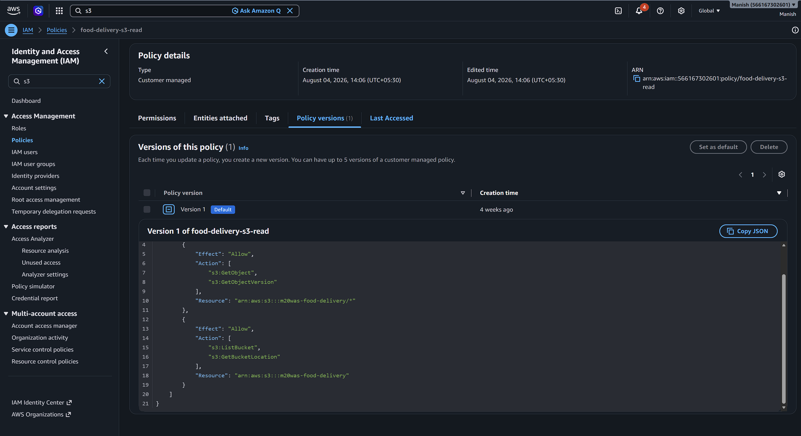
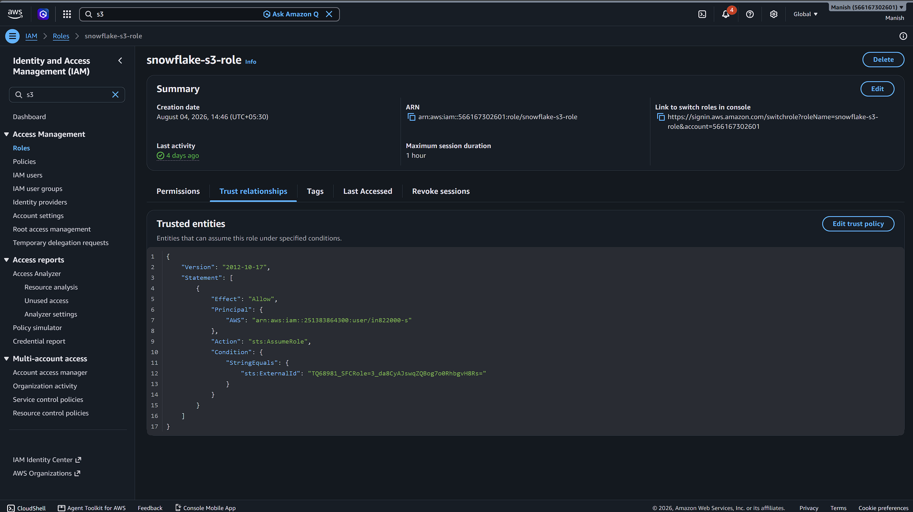
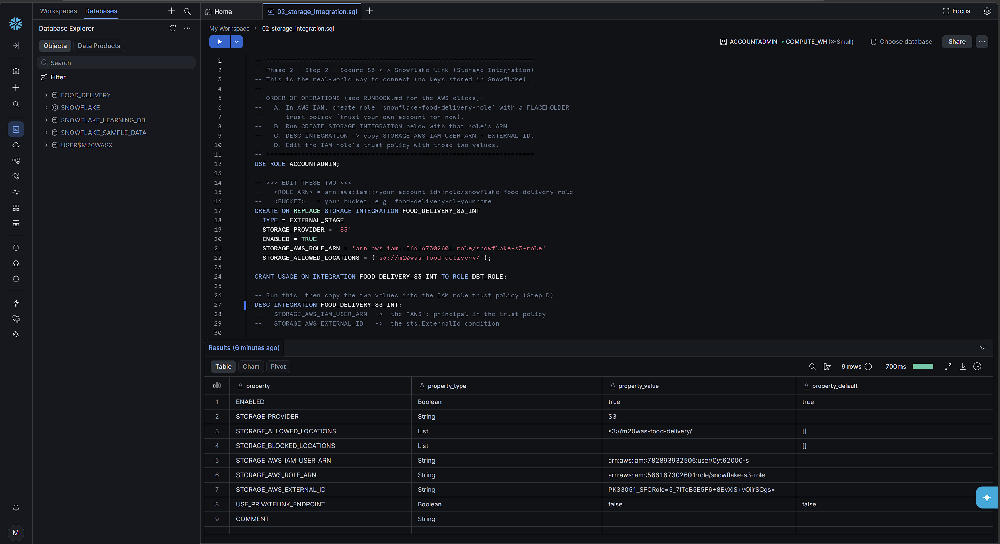

# Storage Integration Notes

## AWS setup sequence

The AWS side of the setup happens first:

1. Create the S3 read policy.
2. Attach that policy to the `snowflake-s3-role` IAM role.
3. Add the trust relationship so Snowflake can assume the role with `sts:AssumeRole` and `sts:ExternalId`.

## AWS policy

Before Snowflake can use the integration, you first create the AWS IAM policy that allows access to the S3 bucket. In this project, that policy is [aws/iam/s3-read-policy.json](../aws/iam/s3-read-policy.json).

The policy allows Snowflake to read from the bucket by granting `s3:GetObject`, `s3:GetObjectVersion`, `s3:ListBucket`, and `s3:GetBucketLocation` on `m20was-food-delivery`.

After the policy, you create the AWS IAM role and attach that policy to it. In this project, the role is `snowflake-s3-role`, and it is the identity Snowflake will assume when it needs to access S3.

The next thing you did was set up the role trust relationship. That is what tells AWS which Snowflake-related identity can assume the role and under what condition. After running [snowflake/02_storage_integration.sql](../snowflake/02_storage_integration.sql), Snowflake returned new `STORAGE_AWS_IAM_USER_ARN` and `STORAGE_AWS_EXTERNAL_ID` values from `DESC INTEGRATION`, and you copied those into the IAM role trust policy so AWS could trust Snowflake safely.

The screenshot above shows `snowflake-s3-role` with the trust relationship configured in AWS.

## AWS role

The role comes after the policy because the role needs that policy attached before Snowflake can use it through the storage integration.

The role in this project is `snowflake-s3-role`. It is the AWS identity that Snowflake trusts, and the policy attachment gives it the exact S3 read permissions it needs. The trust relationship is the separate step that allows Snowflake to assume that role.

The role screenshot above shows the trust policy that lets Snowflake assume `snowflake-s3-role`.

## Snowflake connection success

The storage integration was created successfully in Snowflake, which means the AWS policy, IAM role, and trust relationship were all wired up correctly. After running the Snowflake script, copying the returned `STORAGE_AWS_IAM_USER_ARN` and `STORAGE_AWS_EXTERNAL_ID` into the AWS trust policy, and updating AWS, the connection completed successfully.

The screenshot above shows Snowflake connected successfully through `FOOD_DELIVERY_S3_INT`.