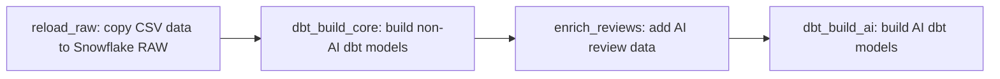

# Airflow Folder Notes

The `airflow/` folder runs the food-delivery pipeline once a day. Airflow's job is to run the steps in the right order: load raw data into Snowflake, build the dbt models, add AI info to reviews, then build the AI models.

Airflow runs locally on your PC via Docker instead of a paid cloud Airflow service (like Cloud Composer or MWAA), so orchestration itself costs nothing. Snowflake and OpenAI usage still cost money when the pipeline actually runs.

## Folder contents

| File or folder | What it is | Why it is needed |
|---|---|---|
| `airflow/docker-compose.yaml` | Setup file that starts Airflow using Docker. | Starts everything Airflow needs with one command. It also gives containers the Snowflake/OpenAI settings and shares the DAG, dbt project, and AI script with them. |
| `airflow/Dockerfile` | Instructions for building the Airflow Docker image. | The normal Airflow image does not have Snowflake support, OpenAI, or dbt. This file adds them. |
| `airflow/example.env` | Empty template for secret settings. | Should list the variable names (no real values) so others know what to put in their own `.env` file. |
| `airflow/dags/` | Folder Airflow looks in to find pipelines. | Airflow reads the Python files here and shows each pipeline in its UI. |
| `airflow/dags/food_delivery_batch.py` | The pipeline definition, named `food_delivery_batch`. | Defines the daily steps, what each step runs, and the order they run in. |
| `airflow/dags/.env` | Local file with real settings for this machine. | Holds things like passwords. Keep it out of Git since it can hold secrets. |

## `docker-compose.yaml`

This file starts five things:

| Service | What it does | Why it exists |
|---|---|---|
| `postgres` | A small database just for Airflow itself. Started to store Airflow's own data - not the food-delivery data. | Airflow needs somewhere to remember its own pipelines and runs. See below for more detail. |
| `airflow-init` | Sets up that database and creates the admin login, one time. | Has to run once before anything else can start. |
| `apiserver` | Runs the Airflow website at `http://localhost:8080`. | Lets you see pipelines, start runs, and read logs in your browser. |
| `scheduler` | Watches the clock and starts tasks when they are due. | Makes `food_delivery_batch` run every day on its own. |
| `dag-processor` | Reads the Python files in `dags/`. | Turns `food_delivery_batch.py` into a pipeline Airflow can show and run. |

**What is `postgres` exactly?** It is not the Snowflake warehouse and has nothing to do with the food-delivery data itself. It is Airflow's own small database, just for Airflow's bookkeeping: what pipelines exist, whether each task passed or failed, when the next run should start, and who can log in. The other services keep reading and writing to it while the pipeline runs.

A few important settings in this file:

- `LocalExecutor` means tasks run right there on your machine, inside the containers.
- `AIRFLOW_CONN_SNOWFLAKE_DEFAULT` tells Airflow how to connect to Snowflake: database `FOOD_DELIVERY`, schema `RAW`, warehouse `FOOD_DELIVERY_WH`, role `DBT_ROLE`.
- `../food_delivery:/opt/airflow/dbt/food_delivery` shares your local dbt project with the containers.
- `../ai:/opt/airflow/ai` shares the AI review script with the containers.
- `./dags` and `./logs` are shared too, so you can see pipeline changes and logs right on your computer.

## `Dockerfile`

This starts from the official `apache/airflow:3.0.3` image and adds what this project needs:

- `apache-airflow-providers-snowflake`: lets Airflow talk to Snowflake and run `COPY INTO`.
- `apache-airflow-providers-fab`: gives the simple username/password login screen.
- `openai`: needed for the review-enrichment step.
- `dbt-snowflake==1.8.*`: lets Airflow run dbt against Snowflake.

dbt is installed in its own separate folder (`/opt/airflow/dbt_venv`) instead of mixing with Airflow's own Python packages. This keeps the two from breaking each other.

## `dags/food_delivery_batch.py`

This file was renamed from `food_delivery.py` to `food_delivery_batch.py` to match the DAG's `dag_id`.

This file defines one pipeline called `food_delivery_batch`.

- **Schedule:** `@daily` - runs once every day.
- **Start date:** `2024-01-01` - the earliest date it is allowed to run for.
- **Catchup:** `False` - don't try to run all the missed past days, just move forward.
- **Tags:** `food_delivery`, `dbt`, `snowflake` - labels to help find it in the Airflow UI.

### Step order



| Step | What it does | Why it runs here |
|---|---|---|

**Why `dbt_build_core`/`dbt_build_ai` need `food_delivery/profiles.yml`:** both tasks run dbt with `--profiles-dir /opt/airflow/dbt/food_delivery`, which tells dbt to look for `profiles.yml` inside the mounted project folder instead of the default `~/.dbt/profiles.yml` used for local runs. Without that file, dbt fails with `Could not find profile named 'food_delivery'`. The committed `profiles.yml` reads credentials from `SNOWFLAKE_ACCOUNT`/`SNOWFLAKE_USER`/`SNOWFLAKE_PASSWORD` env vars, so it's safe to keep in the repo - do not delete it.
| `reload_raw` | Copies restaurant, user, food, menu, order, order-item, and review files into Snowflake's `FOOD_DELIVERY.RAW` schema. | dbt needs fresh raw data before it can clean or transform anything. |

**Why copy CSV files into raw tables at all?** dbt only runs SQL against Snowflake tables - it cannot read CSV files directly. The CSV files start out sitting in a Snowflake stage as plain files, so `reload_raw` runs `COPY INTO` to turn them into real, queryable tables in `FOOD_DELIVERY.RAW`. That is the required starting point (the Bronze/RAW layer) before any `stg_*` staging model can select from them.
| `dbt_build_core` | Runs `dbt build --exclude tag:ai` - builds and tests every model except the AI ones. | Gets staging, dimensions, facts, and regular marts ready first. |
| `enrich_reviews` | Runs the `enrich_reviews.py` script. | Adds AI-generated info to reviews, once the core data is ready. |
| `dbt_build_ai` | Runs `dbt build --select tag:ai` - builds and tests only the AI-tagged models. | These models need the AI-enriched review data from the step before. |

`DBT` and `DBT_PROJECT` are just shortcuts (variables) for the dbt program's path and the project folder's path, so they don't have to be typed out twice.

## Environment variables

Docker Compose needs these values to be set before it starts:

| Variable | Used for |
|---|---|
| `SNOWFLAKE_ACCOUNT` | Which Snowflake account to connect to. |
| `SNOWFLAKE_USER` | Snowflake login name. |
| `SNOWFLAKE_PASSWORD` | Snowflake password. |
| `OPENAI_API_KEY` | Lets the review-enrichment step call OpenAI. |
| `SAMPLE_N` | How many reviews to process; defaults to `5` if not set. |

Never put real passwords or keys directly in files that get committed to Git. Put them in your own local `.env` file instead, and make sure Git ignores it.

## Run locally

Needs Docker installed and running. Download and install [Docker Desktop](https://www.docker.com/products/docker-desktop/), open it, and wait until it shows Docker is running before using the commands below.

From the `airflow` folder:

```bat
docker compose build
docker compose up -d
```

- `docker compose build` builds the custom Airflow image from `Dockerfile`. Run it the first time, and again any time `Dockerfile` changes.
- `docker compose up -d` starts all the services (`postgres`, `airflow-init`, `apiserver`, `scheduler`, `dag-processor`) in the background, so your terminal is free to use for other things.

Open `http://localhost:8080`, then start `food_delivery_batch` from the Airflow UI. To stop everything:

```bat
docker compose down
```

`docker compose down` is the opposite of `docker compose up -d` - it stops and removes the containers (and network) so nothing keeps running in the background. It does not start anything. Airflow's metadata in the `pgdata` volume is kept, so running `docker compose up -d` again picks up where you left off. Add `-v` (`docker compose down -v`) only if you also want to delete that stored data.
```
