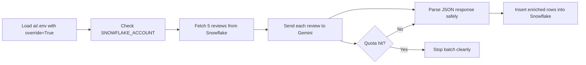

# Gemini Review Enrichment Notes

This note explains the latest changes you made to the review-enrichment workflow in `ai/test.ipynb` and `ai/enrich_reviews.py`.

## Visual Summary



### What changed in one glance

| Area | Before | Now |
|---|---|---|
| Environment loading | Notebook could pick up the wrong Snowflake values | Loads the exact `ai/.env` file with `override=True` |
| Gemini model | `gemini-3.8-flash` / `gemini-2.5-flash` caused problems | Uses `gemini-3.6-flash` |
| Output handling | Assumed raw JSON would always parse | Strips fences and extracts the JSON object first |
| Quota behavior | Batch could fail noisily | Stops cleanly and saves only successful rows |

### The pipeline in plain English

1. Read the local `.env` file.
2. Confirm Snowflake is pointing at the correct account.
3. Pull a small review sample.
4. Ask Gemini to classify each review.
5. Clean the model output if it is wrapped in extra text.
6. Save the good rows to Snowflake.
7. Stop early if the Gemini quota is exhausted.

## What you were trying to do

You wanted to:

- test Gemini in a notebook first
- connect the notebook to the correct Snowflake account from `ai/.env`
- replace the earlier OpenAI-style enrichment flow with Gemini
- keep the code interview-friendly, readable, and compact
- make the pipeline stop gracefully when Gemini quota is exhausted
- switch to a Gemini model that is more practical for free-tier or low-cost use

## Files involved

| File | What changed |
|---|---|
| `ai/test.ipynb` | Used as the main test bed for Gemini and Snowflake. It now loads the exact `ai/.env` file, prints the Snowflake account, and runs the review enrichment pipeline. |
| `ai/enrich_reviews.py` | The standalone script version of the same pipeline. It now uses Gemini instead of OpenAI, parses JSON more safely, and handles quota limits more cleanly. |
| `ai/.env` | The local secrets file used by both notebook and script. It supplies Snowflake credentials and the Gemini API key. |

## Notebook flow in `ai/test.ipynb`

The notebook currently has three main cells:

1. A small Gemini test cell that sends a simple prompt and prints the response.
2. A Snowflake environment check cell that prints `SNOWFLAKE_ACCOUNT`.
3. A full enrichment cell that fetches reviews from Snowflake, classifies them with Gemini, and inserts the enriched rows back into Snowflake.

### Cell 1: Gemini smoke test

The first code cell does a minimal API call:

- imports `os`, `google.generativeai as genai`, and `load_dotenv`
- loads the exact `ai/.env` file with `override=True`
- configures Gemini with `GEMINI_API_KEY`
- creates a `GenerativeModel`
- sends a short prompt asking Gemini to say hello and mention the model
- prints the response

Purpose:

- confirm the API key works
- confirm the notebook kernel can reach Gemini
- make sure the model name is valid before touching the larger pipeline

### Cell 2: Snowflake account check

The second code cell only does one thing:

- loads the same exact `.env` file
- prints `SNOWFLAKE_ACCOUNT`

Purpose:

- verify the notebook is reading the correct environment values
- prove that the old expired account was being overridden
- catch the common issue where a stale environment variable silently wins over the `.env` file

This was important because the notebook initially kept picking up the wrong Snowflake account until `load_dotenv(..., override=True)` was added with the explicit file path.

### Cell 3: Enrichment pipeline

The third code cell contains the actual workflow.

#### Top-level setup

The cell:

- imports `os`, `json`, `re`, `snowflake.connector`, `google.generativeai as genai`, and `load_dotenv`
- loads `ai/.env` with `override=True`
- configures Gemini with `GEMINI_API_KEY`
- sets `MODEL = "gemini-3.6-flash"`
- sets `SAMPLE_N = 5`
- defines the review topics list
- builds the prompt that tells Gemini to return JSON with:
  - `sentiment_label`
  - `sentiment_score`
  - `topic`
  - `key_issue`
- creates the `GenerativeModel` instance

#### `get_connection()`

This function opens the Snowflake connection using environment variables:

- `SNOWFLAKE_USER`
- `SNOWFLAKE_PASSWORD`
- `SNOWFLAKE_ACCOUNT`
- `SNOWFLAKE_WAREHOUSE`
- `SNOWFLAKE_DATABASE`
- `SNOWFLAKE_SCHEMA`

Purpose:

- keep credentials out of code
- make the connection reusable from both notebook and script
- make it obvious where Snowflake settings come from

#### `create_output_table(cursor)`

This function creates the target schema and table if they do not already exist:

- `FOOD_DELIVERY.AI`
- `FOOD_DELIVERY.AI.REVIEW_ENRICHED`

The table stores:

- `REVIEW_ID`
- `SENTIMENT_LABEL`
- `SENTIMENT_SCORE`
- `TOPIC`
- `KEY_ISSUE`
- `MODEL`
- `ENRICHED_AT`

Purpose:

- make the pipeline idempotent
- ensure the output table is ready before inserts
- avoid manual setup each time you run the notebook

#### `get_reviews_to_enrich(cursor)`

This function selects reviews from `FOOD_DELIVERY.RAW.REVIEWS` that are not already present in `FOOD_DELIVERY.AI.REVIEW_ENRICHED`.

It limits the batch with `SAMPLE_N`.

Purpose:

- avoid reprocessing the same reviews
- keep test runs small and cheap
- make the notebook easy to demo

#### `parse_json_response(text)`

This helper cleans Gemini output before parsing it as JSON.

It:

- trims whitespace
- removes fenced code blocks like ```json
- extracts the text between the first `{` and last `}`
- parses the JSON object with `json.loads`

Purpose:

- protect against model output that includes markdown fences or extra text
- make the pipeline more reliable than calling `json.loads(response.text)` directly

This was added after Gemini returned a valid answer that was not perfectly raw JSON.

#### `classify_review(comment)`

This function sends one review comment to Gemini and returns the parsed JSON.

It also catches quota-related errors:

- if the error contains `429` or `quota`, it prints a clear message
- then returns `None` so the batch stops cleanly

Purpose:

- classify one review at a time
- stop gracefully when quota is exhausted
- avoid a crash that wastes the rest of the batch

#### `save_results(cursor, results)`

This function does a batch insert into Snowflake with `executemany`.

Purpose:

- insert all successful classifications together
- reduce the number of database round trips
- keep the pipeline simple and fast

#### `main()`

This is the end-to-end flow:

1. connect to Snowflake
2. create the output table if needed
3. fetch reviews to enrich
4. loop through the reviews
5. classify each review with Gemini
6. stop if quota is hit
7. save only the successful rows
8. commit the Snowflake transaction
9. close the cursor and connection

Purpose:

- give the notebook a single entry point
- keep the code structured like a small production script
- make it easy to explain in an interview

## Why the model changed

You started with `gemini-3.8-flash`, but that ran into quota and availability issues in this environment.

You then moved to `gemini-2.5-flash`, but the API reported that it is not available to new users in this account.

The final working choice was `gemini-3.6-flash`.

Why this matters:

- it is supported in the current account
- it runs successfully in the notebook
- it still gives a flash-style balance of speed and quality
- it is better suited to small review-enrichment batches than a heavier reasoning model

## What happened during testing

The notebook went through three important failure modes:

1. **Wrong Snowflake account**
   - fixed by loading the exact `.env` file with `override=True`
   - verified by printing `SNOWFLAKE_ACCOUNT`

2. **Gemini free-tier quota hit**
   - first caused 429 quota errors
   - fixed in code by stopping the batch cleanly instead of failing the whole loop

3. **Gemini model availability issue**
   - `gemini-2.5-flash` returned a 404 / not available error
   - fixed by switching to `gemini-3.6-flash`

4. **Gemini output not being strict JSON**
   - fixed by adding `parse_json_response()`
   - now the pipeline can handle fenced or slightly noisy output

## Final behavior

The current notebook behavior is:

- loads the exact local `.env` file
- uses the correct Snowflake account
- classifies reviews with `gemini-3.6-flash`
- handles messy Gemini output safely
- stops cleanly when quota is reached
- saves successful rows to Snowflake

In the last successful run, the pipeline processed 5 candidate reviews, classified 1 successfully, and saved that single enriched row to Snowflake before stopping on quota exhaustion.

## Important takeaway

For free-tier Gemini usage in this workflow:

- use a Flash-style model, not a heavier Pro model
- keep batch sizes small
- expect quota limits and handle them in code
- parse model output defensively instead of assuming perfect JSON
- always load the intended `.env` file explicitly when working with multiple environments
