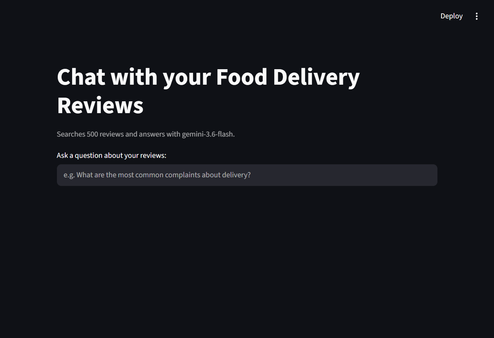

# Streamlit RAG Demo

This note describes the small Streamlit RAG app in `ai/rag_chat.py`.

## What it does

- loads review rows from Snowflake
- finds the most relevant reviews for a question
- sends those reviews to Gemini for the final answer
- shows the answer and the matching reviews in Streamlit

## How to run it

From the project root:

```powershell
cd ai
streamlit run rag_chat.py
```

## Example question

Use a question like:

```text
What are the most common complaints about delivery?
```

## What you see

- a question box
- the Gemini answer
- the top matching reviews used for that answer

## Application Walkthrough



Open the app, ask one question, and show the answer with the matching reviews.

## Why it is simple

- the retrieval step is local and lightweight
- the answer step uses Gemini
- the code stays short and easy to explain
